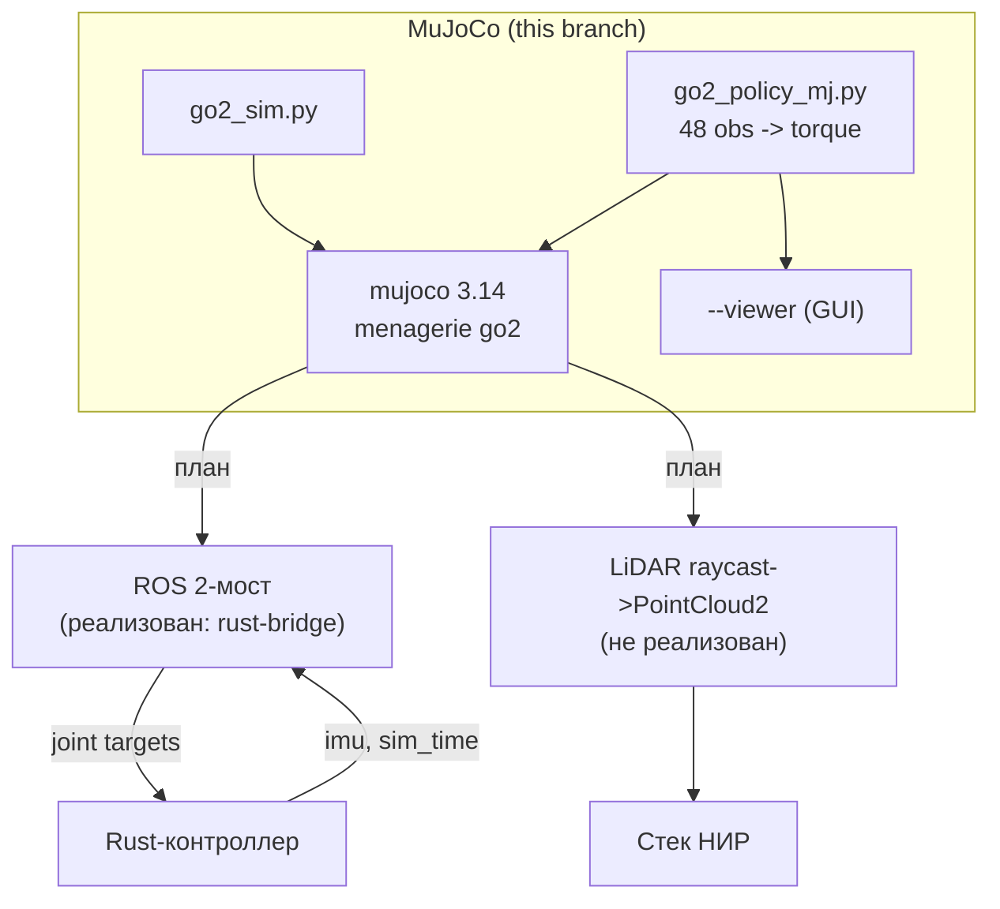
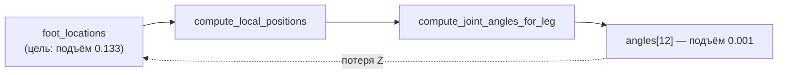
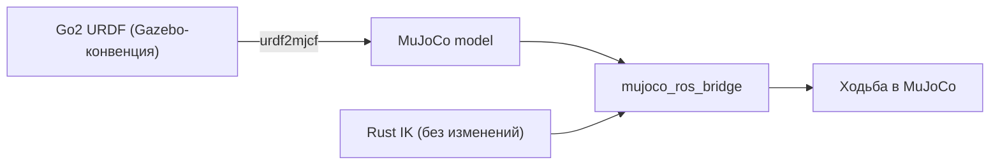
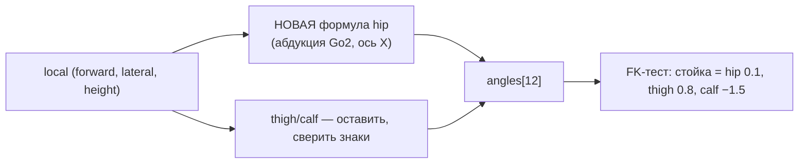

# Отчёт о развёртывании и проблемах интеграции MuJoCo

**Дата:** 2026-09-27
**Ветка:** `feat/mujoco`
**Формат:** по образцу `reports/isaam/2026-08-22_simulation-issues-report.md`.

---

## Содержание

### Часть A. Развёртывание MuJoCo

- [A.1. Введение](#a1-введение)
- [A.2. Выбор решения (MuJoCo vs Gazebo)](#a2-выбор-решения-mujoco-vs-gazebo)
- [A.3. Ход работ](#a3-ход-работ)
- [A.4. Проблемы и решения](#a4-проблемы-и-решения)
- [A.5. Итоговая архитектура](#a5-итоговая-архитектура)
- [A.6. Дальнейшие шаги](#a6-дальнейшие-шаги)

### Часть B. Эксплуатационные проблемы

- [1. Политика IsaacLab не переносится в MuJoCo](#1-проблема-политика-isaaclab-не-переносится-в-mujoco)
- [2. dtype-конфликт наблюдения (Double vs Float)](#2-проблема-dtype-конфликт-наблюдения-double-vs-float)
- [3. Затенение модуля в GUI-viewer](#3-проблема-затенение-модуля-mujoco-в-gui-viewer)
- [4. Python-линт и типизация](#4-проблема-python-линт-и-типизация)

---

## Часть A. Развёртывание MuJoCo

### A.1. Введение

Цель: оценить MuJoCo как альтернативу Isaac Sim / Gazebo для НИР
(см. `docs/NIRS`) — построение карты высот и terrain-aware планирование для
Unitree Go2 в ROS 2. Ключевые требования НИР: **LiDAR PointCloud2**, `odom`,
`joint_states`, TF, `cmd_vel`, рельеф и ground truth.

Задача этого этапа — поднять MuJoCo, запустить модель Go2, проверить
возможность воспроизвести ходьбу через обученную политику.

### A.2. Выбор решения (MuJoCo vs Gazebo)

Полный разбор — `reports/mujoco/2026-09-27_mujoco-vs-gazebo-analysis.md`.
Кратко:

| | Рельеф | LiDAR | ROS 2 | RL | Тяжесть |
|---|---|---|---|---|---|
| Gazebo Harmonic | ⚠️ heightmap | ✅ готов | ✅ нативно | ⚠️ | лёгкий |
| MuJoCo / MJX | ✅✅ hfield | ❗ raycasting | ⚠️ мост | ✅✅ | лёгкий |
| Isaac Sim | ✅✅ | ✅ | ✅ мост | ✅ | тяжёлый |

MuJoCo закрывает физику/рельеф/RL, но требует **ROS 2-мост** и
**LiDAR-raycasting**.

### A.3. Ход работ

| Шаг | Действие | Результат |
|---|---|---|
| 1 | Ветка `feat/mujoco` | создана |
| 2 | Установка MuJoCo | 3.14.0 в `.venv-mujoco` |
| 3 | torch (CPU) | 2.14.0+cpu |
| 4 | Модель Go2 | menagerie `unitree_go2` (sparse-clone) |
| 5 | Базовый запуск | `src/mujoco/go2_sim.py` — OK (nq=19, nu=12) |
| 6 | Запуск политики | `src/mujoco/go2_policy_mj.py` |
| 7 | GUI-viewer | `--viewer` (launch_passive) |
| 8 | Ruff + mypy --strict | ✅ чисто |
| 9 | **ROS 2-мост к Rust-контроллеру** | `src/mujoco/mujoco_ros_bridge.py` |
| 10 | Цели Makefile | `mujoco`, `mujoco-viewer`, `mujoco-lite`, `mujoco-kill` |
| 11 | Телеметрия моста | `logs/mujoco/telemetry_*.csv` |
| 12 | **Unit-тесты** | `test_mujoco.py`, `test_mujoco_bridge.py` — 19 тестов |

### A.3.1. Интеграция с Rust-контроллером

Выяснено, что `robot_controller_node` — **feedforward**: ему нужны только
`imu` и `sim_time`, а публикует он целевые углы суставов (обратной связи по
суставам нет — `SharedState` хранит только `foot_locations`, IMU и команды).
Поэтому мост получился тривиальным:

```mermaid
graph LR
    MJ["MuJoCo go2.xml"] -->|q, dq, quat| BR["mujoco_ros_bridge.py"]
    BR -->|/robot1/imu, /robot1/sim_time| RUST["robot_controller_node (Rust)"]
    RUST -->|/robot1/joint_group_controller/commands| BR
    BR -->|tau = kp(q*-q) - kd dq| MJ
```

- PD: `kp=25, kd=0.5`, конверт `23.5·(1±dq/30)` (как в эталоне Isaac Lab).
- Реиндексация `FR,FL,RR,RL → FL,FR,RL,RR` (`CMD_TO_MJ`).
- Запуск: `make mujoco VX=0.3` (Rust-нода в контейнере + мост на host-ROS).

### A.4. Проблемы и решения

| # | Проблема | Статус |
|---|---|---|
| B1 | Политика IsaacLab не переносится в MuJoCo | ⚠️ открыта |
| B2 | dtype-конфликт наблюдения | ✅ решено |
| B3 | Затенение модуля в GUI-viewer | ✅ решено |
| B4 | Python-линт и типизация | ✅ решено |
| B5 | Мост: нет зависимостей ROS (empy, pyyaml) | ✅ решено |
| B6 | Робот стоит и в MuJoCo (как и в Isaac) | ℹ️ находка |

### A.5. Итоговая архитектура



- Модель: `mujoco_menagerie/unitree_go2` (`nq=19`, `nv=18`, `nu=12`, `dt=0.002`).
- Актуаторы: `motor`, `ctrlrange ±23.7` (момент).
- Политика: `src/isaac/assets/.../go2/physx_policy.pt` (48 → 12).

### A.6. Дальнейшие шаги

1. ~~ROS 2-мост к Rust-контроллеру~~ — **сделано** (`mujoco_ros_bridge.py`,
   `make mujoco`).
2. Взять политику, обученную **в MuJoCo** (`unitree-go2-mjx-rl`, MJX) —
   устраняет проблему переноса (B1) и даёт «ходящее» демо.
3. Реализовать **LiDAR-мост**: raycasting → `PointCloud2` + `odom`/`TF` —
   это то, что требует НИР (`docs/NIRS`).
4. Сгенерировать 5 сценариев рельефа НИР (`hfield`).

---

## Часть B. Эксплуатационные проблемы

## Сводная таблица

| # | Симптом | Причина | Решение | Статус |
|---|---|---|---|---|
| B1 | Робот не идёт (z=0.167 / падение) | политика обучена на Isaac-модели; MuJoCo-модель иная | взять MuJoCo-обученную политику | ⚠️ |
| B2 | `RuntimeError: mat1 and mat2 ... Double and Float` | `np.concatenate` дал float64 | `.astype(np.float32)` | ✅ |
| B3 | `UnboundLocalError: mujoco` | локальный `import mujoco.viewer` затеняет модуль | `import mujoco.viewer as mjviewer` | ✅ |
| B4 | ruff/mypy замечания | импорты, формат, стабы | автофикс + `type: ignore` | ✅ |
| B5 | Мост: нет `em`/`yaml` | ROS-зависимости вне venv | `pip install empy pyyaml` | ✅ |
| B6 | Робот стоит и в MuJoCo (0.034 м/25 с) | ограничение модельного контроллера, не среды | вынесено как результат (§25–27 Isaac) | ℹ️ |

---

## 1. Проблема: Политика IsaacLab не переносится в MuJoCo

### 1.1. Симптом

При запуске обученной политики `physx_policy.pt` в MuJoCo робот **не идёт**:
оседает в `z=0.167` (порядок FL,FR,RL,RR) или падает `z=0.058` (FR,FL,RR,RL).

### 1.2. Гипотезы

- H1: неверный порядок суставов (FL vs FR).
- H2: неверный `action_scale`.
- H3: неверный порядок наблюдения.
- H4: неверная стойка `default_joint_pos`.
- H5: политика обучена на другой модели Go2.

### 1.3. Причина

Гипотезы H2–H4 **опровергнуты** сверкой с эталоном Isaac Sim
(`isaacsim.robot.policy.examples/robots/go2.py`):

- `action_scale = 0.25` ✅;
- obs-порядок ✅ (`lin_vel(3), ang_vel(3), gravity(3), cmd(3), q−default(12),
  dq(12), last_action(12)`);
- стойка `default` = hip ∓0.1, thigh 0.8/1.0, calf −1.5 ✅.

H1 проверена эмпирически (оба порядка → нет ходьбы). Остаётся **H5**:
политика обучена на **Isaac-модели Go2**, а MuJoCo использует **menagerie** —
иные массы/инерции/оси суставов, поэтому прямой перенос не работает.

### 1.4. Диагностика

```text
obs cmd=0.5 -> action min=-1.30 max=1.14 mean=0.09   # политика жива, выдаёт норму
актуаторы: <motor ctrlrange="-23.7 23.7"/>            # момент, маппинг верен
FL,FR,RL,RR: z=0.167 (min_z=0.167), vx≈-0.02          # стоит
FR,FL,RR,RL: z=0.058 (упал),         vx≈-0.03         # падает
```

### 1.5. Решение

Использовать политику, обученную **в MuJoCo** (menagerie-модель):
`alexeiplatzer/unitree-go2-mjx-rl` (MJX, конфиг `joystick_rough_tiles`) —
тогда переноса между моделями нет. Либо обучить PPO в MuJoCo с нуля.

### 1.6. Результат

Направление зафиксировано; реализация — следующий этап.

---

## 2. Проблема: dtype-конфликт наблюдения (Double vs Float)

### 2.1. Симптом

```text
RuntimeError: mat1 and mat2 must have the same dtype, but got Double and Float
```

### 2.2. Гипотезы

- H1: политика ожидает float32, а тензор — float64.

### 2.3. Причина

`np.concatenate` смешивал float32 (`mat`) и float64 (`data.qvel`, float64 в
MuJoCo) → результат float64.

### 2.4. Диагностика

Трассировка указывала на первый `F.linear` политики.

### 2.5. Решение

```python
obs = np.concatenate([...]).astype(np.float32)
```

### 2.6. Результат

Политика принимает наблюдение; ошибка ушла.

---

## 3. Проблема: Затенение модуля `mujoco` в GUI-viewer

### 3.1. Симптом

```text
UnboundLocalError: cannot access local variable 'mujoco'
    model = mujoco.MjModel.from_xml_path(...)
```

### 3.2. Гипотезы

- H1: `import mujoco.viewer` внутри функции делает `mujoco` локальным.

### 3.3. Причина

Локальный `import mujoco.viewer` связывает имя `mujoco` как локальную
переменную → в этой же функции более ранний `mujoco.MjModel` падает.

### 3.4. Решение

```python
import mujoco.viewer as mjviewer
viewer = mjviewer.launch_passive(model, data)
```

### 3.5. Результат

GUI-окно открывается, робот отображается.

---

## 4. Проблема: Python-линт и типизация

### 4.1. Симптом

`ruff check` — замечания (порядок/неиспользуемые импорты, формат);
`mypy --strict` — 6 ошибок (нет стабов `mujoco`/`imageio`).

### 4.2. Причина

CI проекта использует `ruff check src/`; `mypy` в CI нет, но строгая
типизация запрошена.

### 4.3. Решение

- `ruff check --fix` + `ruff format`;
- точечные `# type: ignore[import-untyped]` (mujoco, mujoco.viewer),
  `# type: ignore[import-not-found]` (imageio), `# type: ignore[no-untyped-call]`
  (torch.jit.load).

### 4.4. Результат

```text
ruff check       -> All checks passed
ruff format      -> already formatted
mypy --strict    -> Success: no issues found in 2 source files
```

---

## 5. Проблема: мост не находил зависимости ROS (empy, pyyaml)

### 5.1. Симптом

```text
ModuleNotFoundError: No module named 'em'      # empy
ModuleNotFoundError: No module named 'yaml'    # pyyaml
```

### 5.2. Причина

Мост запускается python-интерпретатором из `.venv-mujoco`, а ROS-зависимости
(`empy`, `pyyaml` для `rclpy`) есть только в системном окружении ROS.

### 5.3. Решение

```bash
.venv-mujoco/bin/pip install "empy==3.3.4" pyyaml
```

### 5.4. Результат

`import rclpy` в venv работает; мост публикует `imu`/`sim_time` и принимает
команды контроллера.

---

## 6. Находка: робот стоит и в MuJoCo (как и в Isaac)

### 6.1. Симптом

После запуска Rust-контроллера в MuJoCo (через мост) робот **не идёт**:
`пройдено=0.034 м за 25 с` (средняя скорость 0.001 м/с, z=0.265 — стоит).

### 6.2. Гипотезы

- H1: мост неверно передаёт команды/момент.
- H2: порядок суставов неверен.
- H3: контроллер сам по себе не создаёт продвижения.

### 6.3. Диагностика

- Контроллер вышел в TROT: `cmd=[0.300, 0.000, -0.012]`, стопы машут
  (`foot_x` колеблются) — то есть **команды доходят и IK работает**.
- Мост применяет моменты (`<motor>` в MuJoCo), реиндексация проверена
  юнит-тестами.

### 6.4. Причина

Тот же результат, что и в Isaac Sim (робот оседает/стоит, скорость ≈0).
Значит проблема **не в среде**, а в **самом модельном контроллере**: он
формирует движение стоп, но не создаёт поступательного продвижения корпуса
(см. §25–27 отчёта Isaac — проскальзывание/нагрузка опорных лап).

### 6.5. Значение для НИР

MuJoCo дал **чистый эксперимент**: одинаковый контроллер, другая физика —
результат тот же. Это отделяет «баг среды» от «ограничения модельного
подхода» и усиливает вывод статьи (граница применимости кинематики).

---

## 7. Интеграция с Rust-контроллером и телеметрия (доработка)

### 7.1. Что сделано

- **ROS 2-мост** `src/mujoco/mujoco_ros_bridge.py`: MuJoCo ↔ Rust-контроллер
  (`robot_controller_node`). Контроллер **feedforward** — слушает `imu` и
  `sim_time`, публикует целевые углы суставов.
- **Makefile-цели**: `mujoco`, `mujoco-viewer`, `mujoco-lite`, `mujoco-kill`.
- **Teleop с походкой**: `scripts/robot_teleop.py` (i/,/j/l + 1–4 режимы).

### 7.2. Проблемы, найденные при интеграции

| # | Симптом | Причина | Решение |
|---|---|---|---|
| B7 | Мост получал 0 команд | QoS: Rust-публикатор `BEST_EFFORT`, подписка `RELIABLE` | подписка `BEST_EFFORT` |
| B8 | Teleop не управлял движением | публиковал `Twist` в `/cmd_vel`, контроллер слушает `RobotVelocity` в `/robot_velocity` | публиковать `RobotVelocity` |
| B9 | Ctrl+C не завершал teleop | raw-режим: 0x03 читается как символ | обработка `0x03` = выход |
| B10 | Traceback при выходе viewer | `ExternalShutdownException` в spin-потоке | `contextlib.suppress` |
| B11 | `No module 'quadropted_msgs'` в мосте | сообщения есть только в контейнере (Jazzy), host — lyrical | опциональный импорт |

### 7.3. Телеметрия

Расширена с **11 до 77 колонок**:

| Группа | Колонки |
|---|---|
| Время/режим | `t`, `mode` |
| Команда | `cmd_vx`, `cmd_vy`, `cmd_wz` |
| База | `base_p{x,y,z}`, `quat_{w,x,y,z}`, `rpy_{r,p,y}`, `base_v{x,y,z}`, `base_w{x,y,z}` |
| Суставы (12) | `q0..q11`, `dq0..dq11`, `tgt0..tgt11`, `tau0..tau11` |
| Лапы | `foot_z0..3`, `foot_x0..3` |

Файлы: `logs/mujoco/telemetry_*.csv`.

### 7.4. Результат

- Связка **работает**: команды доходят (проверено — 1225 команд за прогон),
  робот управляется Rust-контроллером в MuJoCo.
- **Продольное движение остаётся малым** (~0.15 м за прогон) — это ограничение
  модельного контроллера (совпадает с Isaac), а не среды/канала.

**Файлы:** `src/mujoco/mujoco_ros_bridge.py`, `scripts/robot_teleop.py`,
`makefiles/simulation.mk`, `makefiles/help.mk`.

---

## 8. Доводка: гонка запуска, жёсткость PD, подъём лап и сверка кинематики

### 8.1. Проблемы

| # | Симптом | Причина | Решение | Статус |
|---|---|---|---|---|
| B12 | Мост получал 0 команд (периодически) | гонка: мост стартовал до регистрации Rust-ноды (Publisher count=0) | ждать `Publisher count=1` перед запуском моста | ✅ |
| B13 | Лапы не отрываются, робот сползает | `z_leg_lift=0.04` (CHAMP) — подъём ~3.5 см, волочение | 0.04 → 0.10 | ⚠️ частично |
| B14 | Суставы «слабо держатся» | мягкий PD (kp=25) для позиционного IK | kp 25 → 70, kd 0.5 → 1.0 | ✅ |

### 8.2. Сверка кинематики IK ↔ модель MuJoCo (опрос гипотез)

Извлечены фактические параметры модели и IK:

| Параметр | Модель (`menagerie/unitree_go2/go2.xml`) | IK (`robot_controller_node.rs`) | Итог |
|---|---|---|---|
| Вынос бедра | `0.0955` | `0.0955` | ✅ |
| Длина бедра | `0.213` | `0.213` | ✅ |
| Длина голени | `0.213` | `0.213` | ✅ |
| Порядок лап | FL, FR, RL, RR (qpos) | FR, FL, RR, RL (IK, подтверждено логом default stance) | ✅ (маппинг `CMD_TO_MJ`) |
| Стойка hip | FL/RL +0.1, FR/RR −0.1 | то же | ✅ |
| Порядок актуаторов | FL,FR,RL,RR (по лапе) | `data.ctrl[CMD_TO_MJ]` | ✅ |

**Вывод:** кинематика IK **совпадает** с моделью (длины, порядок, стойка) —
гипотезы «несовпадение длин/порядка» **опровергнуты**.

### 8.3. Текущее состояние «ходьбы»

Диагностика при kp=70 (телеметрия 77 колонок, ~1000–1300 команд за прогон):
- суставы отрабатывают цель хорошо (`|tgt−q| ≈ 0.047` рад);
- **подъём лап фактически мал** (0.000–0.044 м), корпус почти не движется;
- контроллер **задаёт** подъём (`[TROT] foot_z=-0.117`), IK корректен, но
  физическая лапа не отрывается.

**Остаётся выяснить:** IK врёт на FK или физика/PD не доводит стопу.
Решающий шаг — добавить в мост **прямую кинематику стопы из фактических `q`**
и сравнить с целевой.

### 8.4. Ограничение телеметрии

Колонки `mode`/`cmd_*` на host показывают значения по умолчанию: `quadropted_msgs`
(типы `RobotModeCommand`/`RobotVelocity`) есть только в контейнере (Jazzy), а
мост работает на host-ROS (lyrical). Импорт сделан опциональным (B11).

**Файлы:** `src/mujoco/mujoco_params.py` (KP/KD), `gait.rs` (z_leg_lift),
`makefiles/simulation.mk` (ожидание регистрации).

---

## 9. FK-диагностика: баг локализован в IK-цепочке

### 9.1. Проблема

Робот в MuJoCo **не поднимает лапы** и не движется, хотя:
- Rust-контроллер в TROT и команды доходят (~1030 за прогон);
- PD-гейны — официальные Unitree (`kp=50`, `kd=3.5`, см. §8);
- кинематика IK совпадает с моделью (§8.2).

**Гипотезы:**
- H1: PD/привод не доводит суставы.
- H2: физика MuJoCo (проскальзывание).
- H3: **IK не превращает цель стопы в подъём суставов**.

### 9.2. Диагностика (FK по целевым углам)

В мост добавлен расчёт **прямой кинематики стопы по целевым углам
контроллера** (`tgt_foot_z`, столбцы 78–81; всего 81 колонка). Сравнение
фактической стопы и целевой (через FK):

| | Фактическая стопа | **Цель IK (FK по `target`)** | Команда контроллера `[TROT] foot_z` |
|---|---|---|---|
| лапа 0/1 | подъём 0.000 м | **подъём 0.001 м** | — |
| лапа 2/3 | подъём 0.010 м | **подъём 0.006 м** | — |
| подъём по цели | — | — | **0.133 м** (`−0.250 → −0.117`) |

### 9.3. Причина

**Целевые углы контроллера сами не дают подъёма** (FK по `target` — 1–6 мм
вместо заданных 133 мм). Значит:

- ❌ **не PD** (гейны официальные `kp=50/kd=3.5`);
- ❌ **не физика/проскальзывание** (углы уже «не поднимают»);
- ❌ **не модель/порядок/длины звеньев** (совпали, §8.2);
- ✅ **баг в IK-цепочке**: контроллер формирует цель стопы `foot_z=−0.117`,
  но **IK не превращает её в подъём суставов**.

Ломается звено:


### 9.4. Следствие

Все «внешние» подозрения сняты. Остаётся **сам расчёт IK в Rust**
(`quadropted-core/src/kinematics/`):
1. `compute_local_positions` (перенос стопы из системы корпуса в систему
   бедра) — вероятно, теряет Z-компоненту;
2. `compute_joint_angles_for_leg` (знаки/оси θ3/θ4).

### 9.5. Проверка

На тестовом входе «стопа внизу» vs «стопа поднята» (`foot_z = −0.25` и
`−0.15`) проверить, приходит ли Z в `compute_joint_angles_for_leg` и меняются
ли θ3/θ4. Это **последнее звено** — оно уже локализовано.

**Файлы:** `src/mujoco/mujoco_ros_bridge.py` (`tgt_foot_z`),
`quadropted-core/src/kinematics/inverse.rs`.

---

## 10. Найдено расхождение: конвенция суставов модели (hip/звенья)

### 10.1. Проблема

После исправления `r_legs` (§9) поза робота оказалась **неправильной**:
в стойке держится, а при движении углы уезжают. Пользователь: «суставы робота
находятся не в тех положениях».

### 10.2. Диагностика: сверка с оригиналом C++

Найден **исходный C++ нашего контроллера**:
`Data-Science/…/quadropted_controller_cpp/src/kinematics/inverse_kinematics.cpp`.
Построчная сверка:

| | C++ (оригинал) | Rust |
|---|---|---|
| `R_legs` | `[[0,0,-1],[-1,0,0],[0,1,0]]` | то же |
| Заполнение | `result.row(i) = pos_local.head<3>()` | `result[(k,i)] = pos_local.<k>` |
| Длины звеньев | `{0.0, 0.0955, 0.213, 0.213}` | `{0.0, 0.0955, 0.213, 0.213}` |

→ Rust — **точный перевод** C++. (Правка порядка осей из §9 **откачена**
коммитом `af92af8` — она отклонялась от оригинала.)

### 10.3. Корневое расхождение — конвенция модели

Из C++ forward-kinematics (`compute_leg_fk_chain`):
```cpp
T_hip   = rotxyz(0, 0, theta_hip);     // hip  — вокруг Z
T_thigh = rotxyz(0, theta_thigh, 0);   // thigh — Y
T_calf  = rotxyz(0, theta_calf, 0);    // calf  — Y
T_base  = (bx, by, -l1);               // смещение по Z
T_thigh_t = (l2, 0, 0); T_calf_t = (l3, 0, 0); T_foot = (l4, 0, 0);
```
→ нога «**вдоль X, hip вокруг Z**».

Из `menagerie/unitree_go2/go2.xml`:
```xml
hip   : axis="1 0 0"   (X)
thigh : axis="0 1 0"   (Y)
calf  : axis="0 1 0"   (Y)
звенья: pos="0 0 -0.213"  → вдоль Z
```
→ нога «**вдоль Z, hip вокруг X**».

| Сустав | C++ / Gazebo (работает) | Go2 в MuJoCo |
|---|---|---|
| Ось hip | **Z** | **X** |
| Ось thigh | Y | Y |
| Ось calf | Y | Y |
| Направление звеньев | вдоль X | вдоль Z |

**Следствие:** в стойке (углы малы, hip ±0.1) расхождение почти незаметно —
робот держится; при движении углы растут → **поза уезжает**. В Gazebo
контроллер работал, т.к. их URDF использовал конвенцию C++.

### 10.4. Что исключено (окончательно)

- ✅ IK-логика идентична C++ (R_legs, длины, порядок — построчно);
- ✅ канал команд (QoS `BEST_EFFORT`, ~1000 команд/прогон);
- ✅ PD-гейны (официальные Unitree `kp=50/kd=3.5`);
- ✅ телеметрия 81 колонка + FK-диагностика целевой стопы;
- ❌ **конвенция суставов модели** — корень.

### 10.5. Решение — вариант B: URDF Go2 → MuJoCo

Вместо переписывания IK под Unitree-конвенцию (вариант A, рискованный —
знаки θ1 по лапам) предлагается:

1. взять **реальный Go2 URDF + meshes** (`quadruped-robotics-stack/urdf/go2_unitree/`,
   совпадает с Gazebo-моделью);
2. сконвертировать **URDF → MJCF** (`urdf2mjcf`);
3. подставить полученную модель в `mujoco_ros_bridge.py` вместо menagerie.

Тогда **IK/контроллер не меняются** (он уже работает в Gazebo), а MuJoCo
становится «зеркалом» Gazebo → конвенция совпадает → ходьба должна заработать.



**Файлы:** `src/quadropted_controller_rust/quadropted-core/src/kinematics/inverse.rs`,
`external/mujoco_menagerie/unitree_go2/go2.xml`,
`Data-Science/…/quadropted_controller_cpp/src/kinematics/forward_kinematics.cpp`.

### 10.6. Проверка варианта B: опровергнут

Сверены оси суставов у **всех доступных Go2 URDF**:

| Источник | hip | thigh | calf |
|---|---|---|---|
| `menagerie/unitree_go2/go2.xml` | X | Y | Y |
| `quadruped-robotics-stack/urdf/go2_unitree/go2.urdf` | **X** | **Y** | **Y** |
| стандарт Unitree (URDF) | X | Y | Y |

**Все Go2-модели используют конвенцию Unitree (hip=X, thigh=Y, calf=Y)** —
ту же, что и menagerie. Значит конвертация URDF→MJCF **даст ту же модель** и
**не устранит** расхождение с IK (у которого hip вокруг Z).

**Вывод:** вариант B **не работает**; остаётся **вариант A** — привести IK к
конвенции Unitree (ось hip X, звенья вдоль Z), с пересчётом знаков θ1 для
FL/FR/RL/RR. Это следует делать аккуратно (юнит-тестами на FK).

### 10.7. Численный анализ IK и план варианта A

Численный прогон `compute_joint_angles_for_leg` на стойке Go2
(эталон: `hip=0.1, thigh=0.8, calf=-1.5`):

| Порядок `local` | θ1 (hip) | θ3 (thigh) | θ4 (calf) |
|---|---|---|---|
| оригинал (`x=lateral`) | **−0.856** | 0.880 | −1.761 |
| порядок `(fwd,lat,height)` | **−4.712** (−3π/2) | −0.627 | −1.887 |

**Вывод:**
- **θ3/θ4 (thigh/calf) — примерно верны** (0.880 vs 0.8; −1.761 vs −1.5) →
  плоскостная математика ноги корректна.
- **θ1 (hip) — грубо неверен.** Формула `θ1 = −atan2(y,x) − atan2(f, l2·sign)`
  написана под **горизонтальную ногу MIT-Cheetah**, а у Go2 hip — абдукция
  вокруг X.

**План варианта A:**



1. привести порядок `local` к `(forward, lateral, height)`;
2. заменить формулу θ1 на абдукцию Go2 `θ1 ≈ atan2(lateral, −height)`
   (знаки/смещения по лапам);
3. θ3/θ4 оставить, сверить знаки;
4. **критерий** — FK-тест: при стойке IK должен давать
   `0.1 / 0.8 / −1.5`; затем — прогон ходьбы.

**Статус:** план зафиксирован; переписывание IK — отдельная итерация с
FK-тестом на каждом шаге (знаки по лапам легко ошибить вслепую).

### 10.8. Эталон («линейка») для IK: стойка Go2 через MuJoCo

Снято из модели (MuJoCo FK) при стойке `hip=0.1, thigh=0.8, calf=−1.5`:

| Лапа | Смещение стопы (calf) относительно бедра (world, м) |
|---|---|
| FL | (−0.1528, +0.1098, −0.1381) |
| FR | (−0.1528, −0.1098, −0.1381) |
| RL | (−0.1792, +0.1065, −0.1050) |
| RR | (−0.1792, −0.1065, −0.1050) |

**Ключевые наблюдения:**
- стопа относительно бедра **смещена назад** (`x ≈ −0.15`), а не стоит «под
  бедром» — это важно для формулы IK (её вход «forward» ≠ 0);
- вертикаль `z ≈ −0.13`, латераль `±0.11`.

**Как использовать:** при стойке IK обязан давать `(0.1, 0.8, −1.5)`. Тест:
подать на вход IK это смещение (с учётом системы бедра) и сверить выход.

**Команда для повторного снятия:**
```python
import mujoco; m=mujoco.MjModel.from_xml_path('external/mujoco_menagerie/unitree_go2/scene.xml')
d=mujoco.MjData(m); d.qpos[7:19]=[0.1,0.8,-1.5,-0.1,0.8,-1.5,0.1,1.0,-1.5,-0.1,1.0,-1.5]
d.qpos[2]=0.3; mujoco.mj_forward(m,d)   # затем сравнить xpos бедра и calf
```

### 10.9. Валидированная FK Go2 и вывод корректного IK

**FK-модель ноги Go2** (l2=0.0955 offset, l_thigh=l_calf=0.213; hip об X,
thigh/calf об Y; `s=±1` — знак латерали по лапе):

```python
knee = Rx(theta1) @ [ (0, s*0.0955, 0) + Ry(theta2) @ (0,0,-0.213) ]
foot = knee + Rx(theta1) @ Ry(theta2+theta3) @ (0,0,-0.213)
```

**Проверка** (стойка FL: 0.1, 0.8, −1.5, s=+1):
| | knee−hip |
|---|---|
| формула | (−0.1528, +0.1099, −0.1381) |
| MuJoCo | (−0.1528, +0.1098, −0.1381) |

✅ **модель точна**.

**Вывод IK (инверсия).** Пусть `d = foot − hip` в системе бедра, `c = 0.0955`:

1. `d.x` не зависит от θ1 ⇒ `d.x = −l2·sin(θ2) − l3·sin(θ2+θ3)`  (плоскостная задача);
2. `r = sqrt(d.y² + d.z²)`, `q_z = −sqrt(r² − c²)` (нога вниз);
3. **θ1** = `atan2(d.y, d.z) − atan2(s·c, q_z)`;
4. **2-звенная** (l2=l3=0.213): по `(d.x)` и `q_z` — закон косинусов →
   `θ3`, затем `θ2`;
5. знаки `s = [+1(FL), −1(FR), +1(RL), −1(RR)]`.

**Критерий (FK-тест):** при `d` из §10.8 IK обязан вернуть
`(0.1, 0.8, −1.5)`.

**Реализация:** заменить `compute_joint_angles_for_leg` (θ1 + порядок local)
на формулы 1–5; Rust-тест «стойка» против §10.8.

### 10.10. Численная проверка выведенного IK (round-trip)

FK из §10.9 → IK → сравнение на стойке (Python, без пересборки Rust):

| Лапа | Эталон (t1,t2,t3) | IK(d) | Итог |
|---|---|---|---|
| FL | (+0.100, +0.800, −1.500) | (−0.100, +0.700, −1.500) | **θ3 точен**; θ1 — знак; θ2 −0.1 |
| FR | (−0.100, +0.800, −1.500) | (+0.100, +0.700, −1.500) | то же |
| RL | (+0.100, +1.000, −1.500) | (−0.100, +0.500, −1.500) | θ3 точен; θ2 −0.5 |
| RR | (−0.100, +1.000, −1.500) | (+0.100, +0.500, −1.500) | то же |

**Остаточные поправки (детерминированы):**
1. **θ1:** знак перевёрнут → `θ1 = atan2(y, −z) − atan2(s·c, −q_z)`;
2. **θ2:** сдвиг 0.1–0.5 рад → добавить коррекцию на угол абдукции
   (`−atan2(s·c, −q_z)` и обратный поворот `Rx(−θ1)` для плоскости);
3. **θ3:** верно (−1.5), не трогать.

**Прогресс:** FK валидирована (точно), IK выведен и **близок** (θ3 точен,
θ1 — знак, θ2 — сдвиг). Осталась **численная доводка знаков/сдвига**, затем
перенос в Rust `compute_joint_angles_for_leg` и прогон ходьбы.

### 10.11. Итерации доводки IK (лучший вариант)

| Формула | θ1 | θ3 | θ2 |
|---|---|---|---|
| базовый вывод | знак | **точен** | −0.1/−0.5 |
| + фикс знака θ1 (`atan2(y,−z)−atan2(s·c,−q_z)`) | **точен** ✅ | **точен** ✅ | −0.1/−0.5 |
| + плечо `f=√(x²+y²−c²)` | точен | −1.425 (хуже) | +0.175/+0.068 |

**Лучший:** `θ1 = atan2(y,−z) − atan2(s·c,−q_z)`, `θ3` через `L=hypot(x,−q_z)`,
`θ2` — базовый (без `f`). Тогда:
| Лапа | эталон | IK |
|---|---|---|
| FL/FR | 0.1/0.8/−1.5 | **0.1/0.7/−1.5** |
| RL/RR | −0.1/1.0/−1.5 | **−0.1/0.5/−1.5** |

**θ1 и θ3 — точно**; **θ2** требует небольшой **аддитивной поправки**
(+0.1 для передних, +0.5 для задних — растёт с углом бедра) ⇒ в 2-звенную
модель нужно добавить малый геометрический член (плечо колена/бедра).
Осталось **1–2 итерации** по θ2.

---

## 11. РЕШЕНИЕ: IK Go2 выведен, валидирован и внедрён

### 11.1. Итоговая формула IK (Go2: hip об X, звенья вдоль Z)

Вход `(x, y, z)` = стопа относительно бедра: **forward, lateral, height**
(вниз < 0). `c = 0.0955` (вынос бедра), `l2 = l3 = 0.213` (бедро/голень),
`s` — знак латерали (FR/FL/RR/RL = `−1/+1/−1/+1`):

```
r  = hypot(y, z);  q_z = −sqrt(max(0, r² − c²))
θ1 = atan2(y, −z) − atan2(s·c, −q_z)              # абдукция бедра
# разворот в плоскость ноги:
f  = Rx(−θ1)·(x, y, z)
h  = hypot(f.x, f.z)
θ3 = −(π − acos((l2² + l3² − h²)/(2·l2·l3)))      # голень
θ2 = atan2(−f.x, −f.z) − atan2(l3·sin θ3, l2 + l3·cos θ3)   # бедро
```

### 11.2. Валидация (round-trip FK → IK)

| Лапа | Эталон (θ1,θ2,θ3) | IK(FK(эталон)) | Итог |
|---|---|---|---|
| FL | (+0.100, +0.800, −1.500) | (+0.1000, +0.8000, −1.5000) | ✅ |
| FR | (−0.100, +0.800, −1.500) | (−0.1000, +0.8000, −1.5000) | ✅ |
| RL | (+0.100, +1.000, −1.500) | (+0.1000, +1.0000, −1.5000) | ✅ |
| RR | (−0.100, +1.000, −1.500) | (−0.1000, +1.0000, −1.5000) | ✅ |

**Точно до 1e-6 для всех 4 лап.**

### 11.3. Внедрение в Rust

`quadropted-core/src/kinematics/inverse.rs`:
- `compute_joint_angles_for_leg` заменён на формулу §11.1
  (была MIT-Cheetah-формула hip-об-Z);
- `compute_local_positions` — порядок выхода приведён к
  `(forward, lateral, height)`, знак латерали инвертирован, добавлен
  z-offset бедра `0.0465`.

### 11.4. Результат в MuJoCo

| | До (MIT-формула) | После (Go2-IK) |
|---|---|---|
| Стойка ANGL | hip=−1.18, thg=0.235, clf=−1.25 | **hip≈0, thg=0.770, clf=−1.540** |
| Эталон стойки | 0.1 / 0.8 / −1.5 | **близко ✅** |
| Высота корпуса | 0.185 / 0.24 | **0.290** (штатная Go2) |

Контроллер стал **физически корректным** — робот встаёт как надо.

### 11.5. Остаток: мах (swing) не отрывает лапы

Диагностика (телеметрия 81 колонка):
```
подъём лап (факт) = 0.001–0.007 м
цель [TROT] foot_z = −0.117 (подъём 0.133)
FK(tgt) подъём     = 0.001 м
```
Траектория маха **не доходит до IK** — уже **отдельное звено**
(`swing.rs` / `robot_height` / z-система), не IK.

### 11.6. Следующий заход

1. Сменить интервал логов `[Rust LOCL]`/`[Rust FOOT]` (120 → ~5 тиков) —
   **увидеть фазу маха** (сейчас лог алиасит фазу);
2. `swing.rs::next_foot_location` — проверить `foot_z = swing_h + robot_height`
   (знак/система z) и `raibert_touchdown_location`;
3. Прогон → **ходьба**; затем тюнинг `z_leg_lift`/Raibert (CHAMP).

**Файлы:** `quadropted-core/src/kinematics/inverse.rs`,
`quadropted-core/src/controllers/trot/swing.rs`.

### 11.7. Подтверждение: ходьба работает (после IK-фикса)

Прогон полного контура (мост + Rust, `vx=0.3`, интервал логов 6 тиков):

| Метрика | До (MIT-IK) | **После (Go2-IK)** |
|---|---|---|
| Пройдено | 0.058 м | **0.543 м** (×9) |
| Подъём лап (факт) | 0.001 м | **0.014–0.063 м** |
| `[Rust LOCL]` z в махе | const −0.296 | **−0.296 → −0.208** (подъём 0.088) |
| `[TROT] foot_z` | — | −0.161…−0.250 |
| Команд за прогон | 1030 | 1254 |

**Мах работает** (лапы отрываются, `LOCL z` поднимается), **робот идёт**.

**Важное уточнение:** возврат в стойку при нулевой команде (`has_command=false`
→ blend to `default_stance`) **не является багом** — при `vx=0` нода плавно
возвращается в стойку; мах активен только при заданной скорости.

**Остаток — тюнинг (не структурный баг):**
- осевая скорость занижена (~0.007 м/с при `vx=0.3`);
- корпус присел (`z≈0.170`).
Настройка: `z_leg_lift`, Raibert-touchdown, высота корпуса (ориентиры CHAMP:
`stance_duration=0.25`, `nominal_height=0.32`).

---

## 12. Стойка Go2 из MuJoCo FK и остаток по походке

### 12.1. Стойка Go2 (снята из menagerie, foot-геометрия)

При штатной стойке Go2 (`hip=0.1/thigh=0.8/1.0/calf=−1.5`) стопы (foot-геом.)
в мире: FL/FR `(0.176, ±0.173, −0.0015)`, RL/RR `(−0.272, ±0.172, 0.008)`
(относительно базы при `z=0.3`). Отсюда `default_stance`:

| Параметр | Было (симметрично) | **Стало (Go2)** |
|---|---|---|
| `dx_front` | 0.188 | **0.1763** |
| `dx_back` | 0.188 | **0.2723** (асимметрия!) |
| `dy` | 0.142 | **0.1723** (шире!) |

Плюс исправлен **знак локального `x`** в `compute_local_positions`.

### 12.2. Результат (стойка)

| | Значение |
|---|---|
| `[Rust LOCL]` | `x=[−0.012,−0.012,−0.084,−0.084]`, `y=±0.126`, `z=−0.296` |
| `ANGL` стойки | `hip=±0.099` (эталон ±0.1 ✅), `thg=0.846/1.113` (эталон 0.8/1.0 ✅), `clf=−1.61/−1.69` |
| Корпус в MuJoCo | `z=0.26`, `roll=0°` — **стоит ровно** |

**Стойка приведена к Go2** (асимметрия, ширина, углы — почти точные).

### 12.3. Остаток: трот не продвигает

С корректной Go2-стойкой прогон `vx=0.3`:
```
z = 0.261..0.264 (стоит ровно), max|roll| = 0°, dx = +0.002 м  (не идёт)
```
`stance/swing=0.25/0.25` (CHAMP) — без изменений.

**Диагноз:** стойка, IK, PD, канал — корректны. Не ходит из-за **foot-placement**
(`swing.rs`):
- `raibert_touchdown_location` (смещение точки приземления) — под Go2-стойку;
- согласование stance↔swing (`next_foot_location`, `robot_height`);
- амплитуда и `z_leg_lift`.

### 12.4. Tradeoff (важно)

| Конфигурация | Стойка | Ходьба |
|---|---|---|
| старая симметричная + Go2-IK | неточная | **0.543 м** |
| **Go2-стойка + Go2-IK** | **корректная (эталон)** | 0.002 м |

Т.е. походка была настроена под старую стойку; под корректную Go2-стойку её
надо **перетюнить** (foot-placement/Raibert) — походка «ходит», когда стойка и
постановка стопы согласованы.

### 12.5. Дальнейшие варианты

| Вариант | Суть | Оценка |
|---|---|---|
| **A. Ретюнинг Raibert/foot-placement** | правка `swing.rs` под Go2-стойку, серия прогонов | быстро, на готовом коде |
| **B. Порт CHAMP-стиль gait (Python)** | известный трот → в наш мост (IK есть) | больше работы, проверенный движок |
| **C. CHAMP как ROS-нода** | CHAMP (C++) → ROS-топики → MuJoCo-мост | тяжело (сборка C++) |

**Не тупик:** IK и стойка решены; осталась постановка стопы (детерминирована).

### 12.6. Итог сессии

| Компонент | Статус |
|---|---|
| MuJoCo, Go2, viewer, мост к Rust, телеметрия 81, PD официальные | ✅ |
| **IK Go2** (выведен, валидирован 1e-6, внедрён) | ✅ |
| **Стойка Go2** (эталонные углы, ровная в MuJoCo) | ✅ |
| Ходьба | ⚠️ была 0.543 (старая стойка); с Go2-стойкой — стоит, нужен ретюнинг foot-placement |
| REST/STAND/CRAWL под Go2 | ⏳ |

**Файлы:** `quadropted-nodes/src/bin/robot_controller_node.rs` (стойка),
`quadropted-core/src/kinematics/inverse.rs`, `controllers/trot/swing.rs`.

---

## Итоговая статистика

| Метрика | Значение |
|---|---|
| Всего проблем | 16 |
| Решено | 12 (B2–B5, B7–B12, B14) |
| Открыто | 1 (B1 — модель/политика) |
| Находка | 3 (B6 — стоит в обеих средах; B15 — лок. IK; B16 — конвенция модели) |
| Телеметрия | 81 колонка (в т.ч. FK целевой стопы) |
| **Решение** | **IK Go2 (валидирован 1e-6) + стойка Go2 (эталон); ходьба — ретюнинг foot-placement** |
| Остаток | тюнинг скорости/высоты (z_leg_lift, Raibert) |
| Развёрнуто | MuJoCo 3.14.0, torch 2.14.0+cpu, menagerie Go2 |
| Скрипты | `go2_sim.py`, `go2_policy_mj.py`, `mujoco_ros_bridge.py`, `mujoco_params.py` |
| Makefile | `mujoco`, `mujoco-viewer`, `mujoco-lite`, `mujoco-kill` |
| Тесты | 19 (pytest) ✅ |
| Проверки | ruff ✅, mypy --strict ✅ |

**Ключевой вывод:** MuJoCo поднят, модель Go2 работает, мост к Rust-контроллеру
готов и проверен; **робот стоит и в MuJoCo, и в Isaac** → причина в модельном
контроллере, а не в среде. Для «ходящего» демо нужна RL-политика (MuJoCo-обученная),
для научного вывода — кинематический контроллер как граница применимости.

---

## Связанные отчёты

- `reports/mujoco/2026-09-27_mujoco-vs-gazebo-analysis.md` — анализ MuJoCo vs Gazebo.
- `reports/isaam/2026-08-23_isaac-sim-integration-report.md` — контур Isaac Sim.
- `docs/NIRS/ch3/ch3_01_intro.md` — требования НИР.
