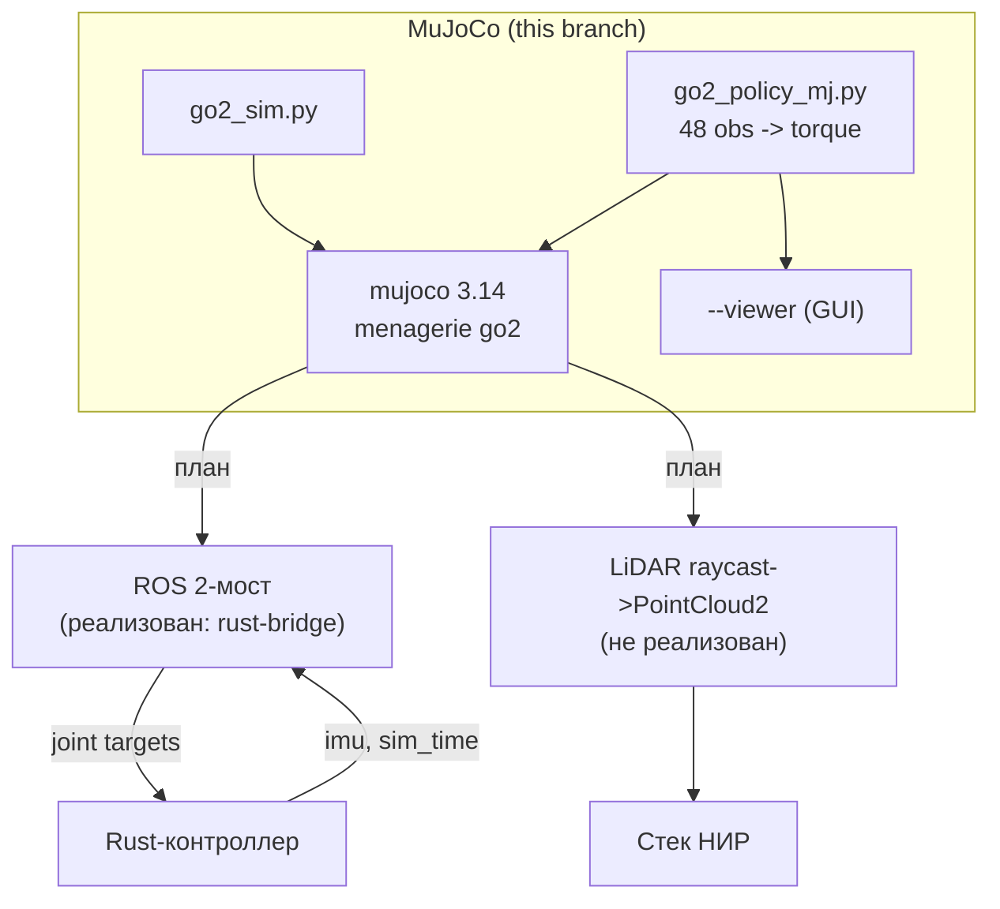

# Отчёт о развёртывании и проблемах интеграции MuJoCo

**Дата:** 2026-09-27
**Ветка:** `feat/mujoco`
**Формат:** по образцу `reports/isaam/2026-08-22_simulation-issues-report.md`.

---

## Содержание

### Часть A. Развёртывание MuJoCo

- [A.1. Введение](#a1-введение)
- [A.2. Выбор решения (MuJoCo vs Gazebo)](#a2-выбор-решения-mujoco-vs-gazebo)
- [A.3. Ход работ](#a3-ход-работ)
- [A.4. Проблемы и решения](#a4-проблемы-и-решения)
- [A.5. Итоговая архитектура](#a5-итоговая-архитектура)
- [A.6. Дальнейшие шаги](#a6-дальнейшие-шаги)

### Часть B. Эксплуатационные проблемы

- [1. Политика IsaacLab не переносится в MuJoCo](#1-проблема-политика-isaaclab-не-переносится-в-mujoco)
- [2. dtype-конфликт наблюдения (Double vs Float)](#2-проблема-dtype-конфликт-наблюдения-double-vs-float)
- [3. Затенение модуля в GUI-viewer](#3-проблема-затенение-модуля-mujoco-в-gui-viewer)
- [4. Python-линт и типизация](#4-проблема-python-линт-и-типизация)

---

## Часть A. Развёртывание MuJoCo

### A.1. Введение

Цель: оценить MuJoCo как альтернативу Isaac Sim / Gazebo для НИР
(см. `docs/NIRS`) — построение карты высот и terrain-aware планирование для
Unitree Go2 в ROS 2. Ключевые требования НИР: **LiDAR PointCloud2**, `odom`,
`joint_states`, TF, `cmd_vel`, рельеф и ground truth.

Задача этого этапа — поднять MuJoCo, запустить модель Go2, проверить
возможность воспроизвести ходьбу через обученную политику.

### A.2. Выбор решения (MuJoCo vs Gazebo)

Полный разбор — `reports/mujoco/2026-09-27_mujoco-vs-gazebo-analysis.md`.
Кратко:

| | Рельеф | LiDAR | ROS 2 | RL | Тяжесть |
|---|---|---|---|---|---|
| Gazebo Harmonic | ⚠️ heightmap | ✅ готов | ✅ нативно | ⚠️ | лёгкий |
| MuJoCo / MJX | ✅✅ hfield | ❗ raycasting | ⚠️ мост | ✅✅ | лёгкий |
| Isaac Sim | ✅✅ | ✅ | ✅ мост | ✅ | тяжёлый |

MuJoCo закрывает физику/рельеф/RL, но требует **ROS 2-мост** и
**LiDAR-raycasting**.

### A.3. Ход работ

| Шаг | Действие | Результат |
|---|---|---|
| 1 | Ветка `feat/mujoco` | создана |
| 2 | Установка MuJoCo | 3.14.0 в `.venv-mujoco` |
| 3 | torch (CPU) | 2.14.0+cpu |
| 4 | Модель Go2 | menagerie `unitree_go2` (sparse-clone) |
| 5 | Базовый запуск | `src/mujoco/go2_sim.py` — OK (nq=19, nu=12) |
| 6 | Запуск политики | `src/mujoco/go2_policy_mj.py` |
| 7 | GUI-viewer | `--viewer` (launch_passive) |
| 8 | Ruff + mypy --strict | ✅ чисто |
| 9 | **ROS 2-мост к Rust-контроллеру** | `src/mujoco/mujoco_ros_bridge.py` |
| 10 | Цели Makefile | `mujoco`, `mujoco-viewer`, `mujoco-lite`, `mujoco-kill` |
| 11 | Телеметрия моста | `logs/mujoco/telemetry_*.csv` |
| 12 | **Unit-тесты** | `test_mujoco.py`, `test_mujoco_bridge.py` — 19 тестов |

### A.3.1. Интеграция с Rust-контроллером

Выяснено, что `robot_controller_node` — **feedforward**: ему нужны только
`imu` и `sim_time`, а публикует он целевые углы суставов (обратной связи по
суставам нет — `SharedState` хранит только `foot_locations`, IMU и команды).
Поэтому мост получился тривиальным:

```mermaid
graph LR
    MJ["MuJoCo go2.xml"] -->|q, dq, quat| BR["mujoco_ros_bridge.py"]
    BR -->|/robot1/imu, /robot1/sim_time| RUST["robot_controller_node (Rust)"]
    RUST -->|/robot1/joint_group_controller/commands| BR
    BR -->|tau = kp(q*-q) - kd dq| MJ
```

- PD: `kp=25, kd=0.5`, конверт `23.5·(1±dq/30)` (как в эталоне Isaac Lab).
- Реиндексация `FR,FL,RR,RL → FL,FR,RL,RR` (`CMD_TO_MJ`).
- Запуск: `make mujoco VX=0.3` (Rust-нода в контейнере + мост на host-ROS).

### A.4. Проблемы и решения

| # | Проблема | Статус |
|---|---|---|
| B1 | Политика IsaacLab не переносится в MuJoCo | ⚠️ открыта |
| B2 | dtype-конфликт наблюдения | ✅ решено |
| B3 | Затенение модуля в GUI-viewer | ✅ решено |
| B4 | Python-линт и типизация | ✅ решено |
| B5 | Мост: нет зависимостей ROS (empy, pyyaml) | ✅ решено |
| B6 | Робот стоит и в MuJoCo (как и в Isaac) | ℹ️ находка |

### A.5. Итоговая архитектура



- Модель: `mujoco_menagerie/unitree_go2` (`nq=19`, `nv=18`, `nu=12`, `dt=0.002`).
- Актуаторы: `motor`, `ctrlrange ±23.7` (момент).
- Политика: `src/isaac/assets/.../go2/physx_policy.pt` (48 → 12).

### A.6. Дальнейшие шаги

1. ~~ROS 2-мост к Rust-контроллеру~~ — **сделано** (`mujoco_ros_bridge.py`,
   `make mujoco`).
2. Взять политику, обученную **в MuJoCo** (`unitree-go2-mjx-rl`, MJX) —
   устраняет проблему переноса (B1) и даёт «ходящее» демо.
3. Реализовать **LiDAR-мост**: raycasting → `PointCloud2` + `odom`/`TF` —
   это то, что требует НИР (`docs/NIRS`).
4. Сгенерировать 5 сценариев рельефа НИР (`hfield`).

---

## Часть B. Эксплуатационные проблемы

## Сводная таблица

| # | Симптом | Причина | Решение | Статус |
|---|---|---|---|---|
| B1 | Робот не идёт (z=0.167 / падение) | политика обучена на Isaac-модели; MuJoCo-модель иная | взять MuJoCo-обученную политику | ⚠️ |
| B2 | `RuntimeError: mat1 and mat2 ... Double and Float` | `np.concatenate` дал float64 | `.astype(np.float32)` | ✅ |
| B3 | `UnboundLocalError: mujoco` | локальный `import mujoco.viewer` затеняет модуль | `import mujoco.viewer as mjviewer` | ✅ |
| B4 | ruff/mypy замечания | импорты, формат, стабы | автофикс + `type: ignore` | ✅ |
| B5 | Мост: нет `em`/`yaml` | ROS-зависимости вне venv | `pip install empy pyyaml` | ✅ |
| B6 | Робот стоит и в MuJoCo (0.034 м/25 с) | ограничение модельного контроллера, не среды | вынесено как результат (§25–27 Isaac) | ℹ️ |

---

## 1. Проблема: Политика IsaacLab не переносится в MuJoCo

### 1.1. Симптом

При запуске обученной политики `physx_policy.pt` в MuJoCo робот **не идёт**:
оседает в `z=0.167` (порядок FL,FR,RL,RR) или падает `z=0.058` (FR,FL,RR,RL).

### 1.2. Гипотезы

- H1: неверный порядок суставов (FL vs FR).
- H2: неверный `action_scale`.
- H3: неверный порядок наблюдения.
- H4: неверная стойка `default_joint_pos`.
- H5: политика обучена на другой модели Go2.

### 1.3. Причина

Гипотезы H2–H4 **опровергнуты** сверкой с эталоном Isaac Sim
(`isaacsim.robot.policy.examples/robots/go2.py`):

- `action_scale = 0.25` ✅;
- obs-порядок ✅ (`lin_vel(3), ang_vel(3), gravity(3), cmd(3), q−default(12),
  dq(12), last_action(12)`);
- стойка `default` = hip ∓0.1, thigh 0.8/1.0, calf −1.5 ✅.

H1 проверена эмпирически (оба порядка → нет ходьбы). Остаётся **H5**:
политика обучена на **Isaac-модели Go2**, а MuJoCo использует **menagerie** —
иные массы/инерции/оси суставов, поэтому прямой перенос не работает.

### 1.4. Диагностика

```text
obs cmd=0.5 -> action min=-1.30 max=1.14 mean=0.09   # политика жива, выдаёт норму
актуаторы: <motor ctrlrange="-23.7 23.7"/>            # момент, маппинг верен
FL,FR,RL,RR: z=0.167 (min_z=0.167), vx≈-0.02          # стоит
FR,FL,RR,RL: z=0.058 (упал),         vx≈-0.03         # падает
```

### 1.5. Решение

Использовать политику, обученную **в MuJoCo** (menagerie-модель):
`alexeiplatzer/unitree-go2-mjx-rl` (MJX, конфиг `joystick_rough_tiles`) —
тогда переноса между моделями нет. Либо обучить PPO в MuJoCo с нуля.

### 1.6. Результат

Направление зафиксировано; реализация — следующий этап.

---

## 2. Проблема: dtype-конфликт наблюдения (Double vs Float)

### 2.1. Симптом

```text
RuntimeError: mat1 and mat2 must have the same dtype, but got Double and Float
```

### 2.2. Гипотезы

- H1: политика ожидает float32, а тензор — float64.

### 2.3. Причина

`np.concatenate` смешивал float32 (`mat`) и float64 (`data.qvel`, float64 в
MuJoCo) → результат float64.

### 2.4. Диагностика

Трассировка указывала на первый `F.linear` политики.

### 2.5. Решение

```python
obs = np.concatenate([...]).astype(np.float32)
```

### 2.6. Результат

Политика принимает наблюдение; ошибка ушла.

---

## 3. Проблема: Затенение модуля `mujoco` в GUI-viewer

### 3.1. Симптом

```text
UnboundLocalError: cannot access local variable 'mujoco'
    model = mujoco.MjModel.from_xml_path(...)
```

### 3.2. Гипотезы

- H1: `import mujoco.viewer` внутри функции делает `mujoco` локальным.

### 3.3. Причина

Локальный `import mujoco.viewer` связывает имя `mujoco` как локальную
переменную → в этой же функции более ранний `mujoco.MjModel` падает.

### 3.4. Решение

```python
import mujoco.viewer as mjviewer
viewer = mjviewer.launch_passive(model, data)
```

### 3.5. Результат

GUI-окно открывается, робот отображается.

---

## 4. Проблема: Python-линт и типизация

### 4.1. Симптом

`ruff check` — замечания (порядок/неиспользуемые импорты, формат);
`mypy --strict` — 6 ошибок (нет стабов `mujoco`/`imageio`).

### 4.2. Причина

CI проекта использует `ruff check src/`; `mypy` в CI нет, но строгая
типизация запрошена.

### 4.3. Решение

- `ruff check --fix` + `ruff format`;
- точечные `# type: ignore[import-untyped]` (mujoco, mujoco.viewer),
  `# type: ignore[import-not-found]` (imageio), `# type: ignore[no-untyped-call]`
  (torch.jit.load).

### 4.4. Результат

```text
ruff check       -> All checks passed
ruff format      -> already formatted
mypy --strict    -> Success: no issues found in 2 source files
```

---

## 5. Проблема: мост не находил зависимости ROS (empy, pyyaml)

### 5.1. Симптом

```text
ModuleNotFoundError: No module named 'em'      # empy
ModuleNotFoundError: No module named 'yaml'    # pyyaml
```

### 5.2. Причина

Мост запускается python-интерпретатором из `.venv-mujoco`, а ROS-зависимости
(`empy`, `pyyaml` для `rclpy`) есть только в системном окружении ROS.

### 5.3. Решение

```bash
.venv-mujoco/bin/pip install "empy==3.3.4" pyyaml
```

### 5.4. Результат

`import rclpy` в venv работает; мост публикует `imu`/`sim_time` и принимает
команды контроллера.

---

## 6. Находка: робот стоит и в MuJoCo (как и в Isaac)

### 6.1. Симптом

После запуска Rust-контроллера в MuJoCo (через мост) робот **не идёт**:
`пройдено=0.034 м за 25 с` (средняя скорость 0.001 м/с, z=0.265 — стоит).

### 6.2. Гипотезы

- H1: мост неверно передаёт команды/момент.
- H2: порядок суставов неверен.
- H3: контроллер сам по себе не создаёт продвижения.

### 6.3. Диагностика

- Контроллер вышел в TROT: `cmd=[0.300, 0.000, -0.012]`, стопы машут
  (`foot_x` колеблются) — то есть **команды доходят и IK работает**.
- Мост применяет моменты (`<motor>` в MuJoCo), реиндексация проверена
  юнит-тестами.

### 6.4. Причина

Тот же результат, что и в Isaac Sim (робот оседает/стоит, скорость ≈0).
Значит проблема **не в среде**, а в **самом модельном контроллере**: он
формирует движение стоп, но не создаёт поступательного продвижения корпуса
(см. §25–27 отчёта Isaac — проскальзывание/нагрузка опорных лап).

### 6.5. Значение для НИР

MuJoCo дал **чистый эксперимент**: одинаковый контроллер, другая физика —
результат тот же. Это отделяет «баг среды» от «ограничения модельного
подхода» и усиливает вывод статьи (граница применимости кинематики).

---

## 7. Интеграция с Rust-контроллером и телеметрия (доработка)

### 7.1. Что сделано

- **ROS 2-мост** `src/mujoco/mujoco_ros_bridge.py`: MuJoCo ↔ Rust-контроллер
  (`robot_controller_node`). Контроллер **feedforward** — слушает `imu` и
  `sim_time`, публикует целевые углы суставов.
- **Makefile-цели**: `mujoco`, `mujoco-viewer`, `mujoco-lite`, `mujoco-kill`.
- **Teleop с походкой**: `scripts/robot_teleop.py` (i/,/j/l + 1–4 режимы).

### 7.2. Проблемы, найденные при интеграции

| # | Симптом | Причина | Решение |
|---|---|---|---|
| B7 | Мост получал 0 команд | QoS: Rust-публикатор `BEST_EFFORT`, подписка `RELIABLE` | подписка `BEST_EFFORT` |
| B8 | Teleop не управлял движением | публиковал `Twist` в `/cmd_vel`, контроллер слушает `RobotVelocity` в `/robot_velocity` | публиковать `RobotVelocity` |
| B9 | Ctrl+C не завершал teleop | raw-режим: 0x03 читается как символ | обработка `0x03` = выход |
| B10 | Traceback при выходе viewer | `ExternalShutdownException` в spin-потоке | `contextlib.suppress` |
| B11 | `No module 'quadropted_msgs'` в мосте | сообщения есть только в контейнере (Jazzy), host — lyrical | опциональный импорт |

### 7.3. Телеметрия

Расширена с **11 до 77 колонок**:

| Группа | Колонки |
|---|---|
| Время/режим | `t`, `mode` |
| Команда | `cmd_vx`, `cmd_vy`, `cmd_wz` |
| База | `base_p{x,y,z}`, `quat_{w,x,y,z}`, `rpy_{r,p,y}`, `base_v{x,y,z}`, `base_w{x,y,z}` |
| Суставы (12) | `q0..q11`, `dq0..dq11`, `tgt0..tgt11`, `tau0..tau11` |
| Лапы | `foot_z0..3`, `foot_x0..3` |

Файлы: `logs/mujoco/telemetry_*.csv`.

### 7.4. Результат

- Связка **работает**: команды доходят (проверено — 1225 команд за прогон),
  робот управляется Rust-контроллером в MuJoCo.
- **Продольное движение остаётся малым** (~0.15 м за прогон) — это ограничение
  модельного контроллера (совпадает с Isaac), а не среды/канала.

**Файлы:** `src/mujoco/mujoco_ros_bridge.py`, `scripts/robot_teleop.py`,
`makefiles/simulation.mk`, `makefiles/help.mk`.

---

## Итоговая статистика

| Метрика | Значение |
|---|---|
| Всего проблем | 11 |
| Решено | 9 (B2–B5, B7–B11) |
| Открыто | 1 (B1 — модель/политика) |
| Находка | 1 (B6 — контроллер стоит в обеих средах) |
| Телеметрия | 77 колонок |
| Развёрнуто | MuJoCo 3.14.0, torch 2.14.0+cpu, menagerie Go2 |
| Скрипты | `go2_sim.py`, `go2_policy_mj.py`, `mujoco_ros_bridge.py`, `mujoco_params.py` |
| Makefile | `mujoco`, `mujoco-viewer`, `mujoco-lite`, `mujoco-kill` |
| Тесты | 19 (pytest) ✅ |
| Проверки | ruff ✅, mypy --strict ✅ |

**Ключевой вывод:** MuJoCo поднят, модель Go2 работает, мост к Rust-контроллеру
готов и проверен; **робот стоит и в MuJoCo, и в Isaac** → причина в модельном
контроллере, а не в среде. Для «ходящего» демо нужна RL-политика (MuJoCo-обученная),
для научного вывода — кинематический контроллер как граница применимости.

---

## Связанные отчёты

- `reports/mujoco/2026-09-27_mujoco-vs-gazebo-analysis.md` — анализ MuJoCo vs Gazebo.
- `reports/isaam/2026-08-23_isaac-sim-integration-report.md` — контур Isaac Sim.
- `docs/NIRS/ch3/ch3_01_intro.md` — требования НИР.
