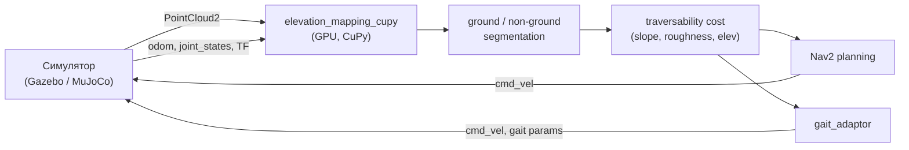

# MuJoCo vs Gazebo: анализ применимости к НИР (Elevation Mapping + terrain-aware планирование)

**Дата:** 2026-09-27
**Ветка:** `feat/mujoco`
**Автор анализа:** инженерный разбор на основе `docs/NIRS` и внешних источников.

---

## 1. Контекст

НИР (см. `docs/NIRS/ch3/ch3_01_intro.md`) — это **ROS 2 Jazzy**-система для
шагающего робота Unitree Go2:

- GPU-ускоренное построение карты высот (`elevation_mapping_cupy`, CuPy, GTX 1650 Ti);
- приём **трёхмерного LiDAR** (`PointCloud2`) из симулятора через Cyclone DDS, QoS и TF;
- сегментация ground / non-ground;
- функция стоимости traversability (уклон, шероховатость, перепады высот);
- **адаптация походки** (высота шага, частота, скорость) по traversability;
- мост GridMap → OccupancyGrid для **Nav2**;
- **валидация в Gazebo** по 5 сценариям рельефа.

Требуемые каналы: `/elevation_map`, `/ground_truth`, `/odom`, `/joint_states`,
`PointCloud2`, TF, `cmd_vel`.

Схема системы (симулятор — источник физики и сенсоров):

---

## 2. Что именно является «симулятор-зависимым»

Ключевое наблюдение: **основной стек НИР симулятор-агностичен**. От симулятора
нужны только:

1. физика + модель Go2;
2. генерация `PointCloud2` (LiDAR);
3. публикация `odom`, `joint_states`, `TF`;
4. приём `cmd_vel`;
5. воспроизводимый рельеф и ground truth.

Всё остальное (elevation_mapping_cupy, сегментация, cost, Nav2, gait_adaptor,
метрики, Docker, DDS) от выбора симулятора **не зависит**.

Следовательно, вопрос «MuJoCo или Gazebo» сводится к: **кто лучше закрывает эти
5 пунктов**.

---

## 3. Покрытие требований: MuJoCo

| Требование НИР                               | MuJoCo | Комментарий                                                                   |
| -------------------------------------------- | ------ | ----------------------------------------------------------------------------- |
| Физика + Go2                                 | ✅     | `mujoco_menagerie/unitree_go2` (`go2.xml`, `go2_mjx.xml`)                     |
| Рельеф (холмы, синус, смешанный)             | ✅✅   | `hfield` + процедурный генератор; **проще Gazebo**                            |
| Ground truth `z = f(x, y)`                   | ✅     | аналитическая функция, независима от симулятора                               |
| RL-походка                                   | ✅✅   | `unitree-go2-mjx-rl` (`joystick_rough_tiles`), MuJoCo Playground              |
| elevation_mapping_cupy                       | ✅     | симулятор-агностичен (CuPy/GPU)                                               |
| ground seg / traversability / Nav2 / метрики | ✅     | ROS-стек, симулятор-агностичен                                                |
| **ROS 2 Jazzy**                              | ⚠️     | нативного нет → мост (`mujoco_ros`, `mujoco_ros2_control`, свой `rclpy`-цикл) |
| **3D LiDAR → PointCloud2**                   | ⚠️❗   | встроенного LiDAR нет → реализовать raycasting → `PointCloud2`                |
| DDS / QoS / TF                               | ⚠️     | через мост                                                                    |
| Docker                                       | ✅     | не зависит от симулятора                                                      |
| GPU CuPy на GTX 1650 Ti                      | ✅     | не зависит от симулятора                                                      |

---

## 4. Сравнение MuJoCo и Gazebo по осям

| Ось              | MuJoCo / MJX                                                        | Gazebo (Harmonic)                                                                      |
| ---------------- | ------------------------------------------------------------------- | -------------------------------------------------------------------------------------- |
| Физика контактов | ✅✅ эталон (создан под робототехнику; стабильные контакты, трение) | ⚠️ gz-physics (DART/Bullet/ODE): универсален, но контакт ног «дрожит», требует тюнинга |
| Скорость         | ✅✅ очень быстро; **MJX = батч на GPU** (тысячи сред)              | ⚠️ медленнее, привязка к real-time (RTF), чувствителен к нагрузке                      |
| Детерминизм      | ✅✅ воспроизводим                                                  | ⚠️ зависит от тайминга                                                                 |
| Рельеф           | ✅✅ `hfield` + процедурный, быстро                                 | ⚠️ heightmap / DEM (PNG/карта), громоздко                                              |
| LiDAR / сенсоры  | ❗ только raycasting; камеры/rangefinder есть                       | ✅✅ готовые плагины (GPU LiDAR, камеры, IMU, depth)                                   |
| ROS 2            | ⚠️ мост                                                             | ✅✅ нативно (gz-ros2)                                                                 |
| RL               | ✅✅ стандарт индустрии (Menagerie, Playground, Brax)               | ❌ не предназначен                                                                     |
| Модели legged    | ✅✅ Menagerie (все четвероногие) + готовые среды                   | ⚠️ меньше моделей                                                                      |
| Установка        | ✅ `pip install mujoco` — минуты                                    | ⚠️ полный стек, версии, GPU/EGL                                                        |
| Sim-to-real      | ✅✅ самый проверенный для legged                                   | ⚠️ реже для legged                                                                     |

### 4.1 Физика

MuJoCo спроектирован для **контактных задач управления** (soft-constraint solver,
стабильные нормальные/тангенциальные контакты, точность на малых шагах).
Для шагающих роботов это критично: дрожание контакта в Gazebo напрямую портит
одометрию по лапам и качество DEM.

### 4.2 Скорость и RL

MJX (MuJoCo на JAX) позволяет параллельно симулировать тысячи сред на GPU —
поэтому **все современные RL-политики четвероногих** обучаются в MuJoCo/Isaac.
Gazebo для RL практически не используется.

### 4.3 Рельеф

MuJoCo: `hfield` (карта высот) и процедурный terrain generator (в Playground) —
рельеф строится кодом, детерминированно, воспроизводимо.
Gazebo: heightmap из изображения или DEM-плагин — работает, но «в мышку» не
редактируется, и сборка мира громоздкая.

### 4.4 Сенсоры и ROS

Gazebo даёт **готовые** плагины GPU LiDAR и нативную интеграцию `gz-ros2`
(PointCloud2 «из коробки»). MuJoCo имеет базовые сенсоры; LiDAR надо
реализовать самому (raycasting → PointCloud2) и поднять ROS-мост.

---

## 5. Найденные готовые решения на MuJoCo

| Решение                                | Робот            | RL-стек          | Рельеф                    | Готовность          |
| -------------------------------------- | ---------------- | ---------------- | ------------------------- | ------------------- |
| **`alexeiplatzer/unitree-go2-mjx-rl`** | **Go2**          | Brax PPO (MJX)   | ✅ `joystick_rough_tiles` | готовые конфиги     |
| `google-deepmind/mujoco_playground`    | **Go1** (не Go2) | JAX PPO          | ✅ rough terrain          | готовый CLI         |
| `google-deepmind/mujoco_menagerie`     | Go2              | — (модель)       | —                         | ассет `go2_mjx.xml` |
| `xiong-del/rl_learning_mujoco`         | Go2              | StableBaselines3 | —                         | базовый             |

Детали:

- **MuJoCo Playground** — официальный, GPU (MJX + MuJoCo Warp), `pip install playground`,
  обучение `train-jax-ppo --env_name Go1JoystickRoughTerrain`. **Go2 в списке сред нет.**
- **unitree-go2-mjx-rl** — Go2 в MJX, конфиги сред: `joystick_basic`,
  `joystick_difficult`, **`joystick_rough_tiles`** (рельеф), `obstacle_avoiding`,
  `target_reaching`, teacher-student + vision.
- **menagerie** — `go2.xml`, `go2_mjx.xml`, `scene.xml`, `scene_mjx.xml`
  (это источник Menagerie-ассета, уже используемого в Isaac-контуре проекта).

---

## 6. Вердикт

**MuJoCo закрывает НИР, но не «из коробки».** Он даёт лучшее, чем Gazebo, в
физике, рельефе, скорости и RL, однако **не имеет нативных ROS 2 и LiDAR**.
Чтобы закрыть все 7 задач НИР, к MuJoCo нужно добавить **два компонента**:

1. **ROS 2-мост** (`rclpy`-цикл поверх MuJoCo, как уже сделан Isaac-мост в
   `src/isaac/`, либо `mujoco_ros2_control`);
2. **LiDAR-симулятор** (raycasting → `PointCloud2`).

Остальной стек (`elevation_mapping_cupy`, сегментация, cost, Nav2, `gait_adaptor`,
метрики) переносится **без изменений** — он общается только через топики.

### Сравнение под НИР

|                 | Рельеф                  | LiDAR         | ROS 2      | RL   | Тяжесть                |
| --------------- | ----------------------- | ------------- | ---------- | ---- | ---------------------- |
| Gazebo Harmonic | ⚠️ heightmap            | ✅ готов      | ✅ нативно | ⚠️   | лёгкий                 |
| MuJoCo / MJX    | ✅✅ hfield/процедурный | ❗ raycasting | ⚠️ мост    | ✅✅ | лёгкий                 |
| Isaac Sim / Lab | ✅✅                    | ✅            | ✅ мост    | ✅   | тяжёлый (RAM/драйверы) |

---

## 7. Рекомендация

- **Критичен LiDAR + ROS 2 «как в Gazebo»** → **Gazebo + heightmap-рельеф**:
  минимум работы, всё нативно, рельеф строится генератором карт высот.
- **Хотите лучшую физику/рельеф и задел на RL** → **MuJoCo**: берём
  `unitree-go2-mjx-rl`, добавляем мост + LiDAR-raycasting; ROS-стек не меняется.
- **Нужно всё сразу** → Isaac Sim (тяжёлый: у проекта уже были проблемы с RAM,
  драйверами NVIDIA и S3-ассетами).

## 8. Следующий шаг (PoC)

Собрать **proof-of-concept** в этой ветке:

1. MuJoCo + `menagerie/go2` + процедурный рельеф (hfield);
2. `rclpy`-мост, публикующий `PointCloud2`, `odom`, `joint_states`, TF;
3. приём `cmd_vel`, запись `rosbag`;
4. прогон одного сценария и проверка топиков, требуемых НИР.

Это докажет выполнимость всех требований НИР в MuJoCo за один прогон.

---

## Источники

- MuJoCo Playground: `github.com/google-deepmind/mujoco_playground`
- Go2 MJX RL: `github.com/alexeiplatzer/unitree-go2-mjx-rl`
- Menagerie Go2: `github.com/google-deepmind/mujoco_menagerie/unitree_go2`
- НИР: `docs/NIRS/ch3/ch3_01_intro.md`, `ch3_10_gait.md`, `ch3_11_testing.md`, `ch3_12_metrics.md`
